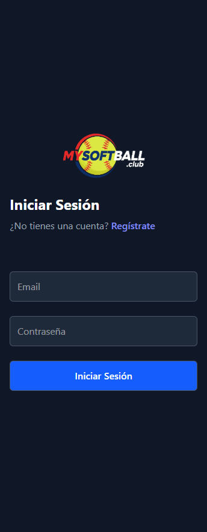
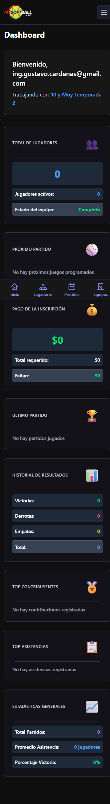
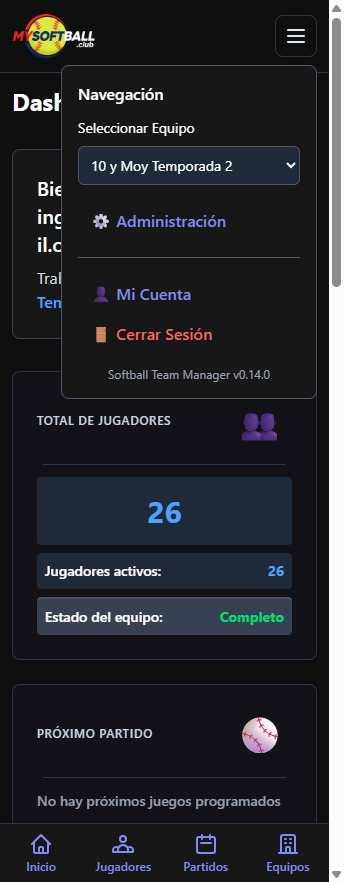
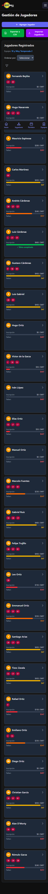
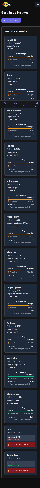
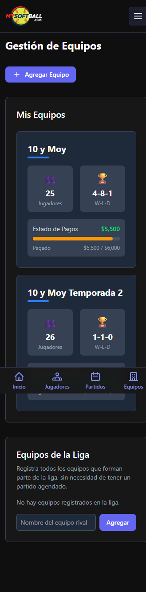
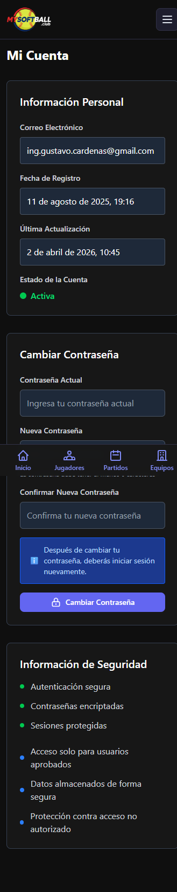

# Softball Team Manager

Aplicación web para la gestión completa de equipos de softball, desarrollada con React 19 y Supabase.

**Versión Actual: 0.14.0**

---

## Capturas de Pantalla (Móvil)

| Login | Dashboard | Menú |
|-------|-----------|------|
|  |  |  |

| Jugadores | Partidos | Equipos | Mi Cuenta |
|-----------|----------|---------|-----------|
|  |  |  |  |

---

## Características

### Gestión de Equipos
- Crear y administrar múltiples equipos con nombre y costo de inscripción
- Estadísticas automáticas de record (Victorias-Derrotas-Empates)
- Estado de pagos en tiempo real con barra de progreso
- Modal de detalles con historial de partidos y jugadores

### Gestión de Jugadores
- Registro completo con nombre, número, teléfono, email y hasta 3 posiciones
- Filtros avanzados por nombre, número y posición
- Ordenamiento por nombre o número de camiseta
- Historial detallado de asistencia y pagos por jugador
- Exportación e importación de jugadores en CSV

### Programación de Partidos
- Crear y gestionar calendario de partidos con oponente, fecha, lugar y pago de umpire
- Control de asistencia integrado por partido
- Gestión de pagos (umpire e inscripción) por jugador
- Finalización de partidos con resultado (marcador)
- Historial completo con detalles expandibles y función de compartir alineación

### Dashboard
- Resumen del equipo: total de jugadores, estado, próximo partido
- Estado de pagos de inscripción con meta dinámica
- Último partido y estadísticas de resultados (W-L-D)
- Top contribuyentes y top asistencias
- Estadísticas generales (total partidos, promedio asistencia, % victoria)

### Autenticación y Cuenta
- Inicio de sesión seguro con Supabase Auth
- Registro sujeto a aprobación manual del administrador
- Página "Mi Cuenta": información personal, fechas y cambio de contraseña

### Navegación
- Barra inferior con acceso rápido: Inicio, Jugadores, Partidos, Equipos
- Menú hamburguesa con selector de equipo, Administración, Mi Cuenta y Cerrar Sesión
- Panel de administración exclusivo para el email administrador

---

## Tecnologías

| Capa | Tecnología |
|------|-----------|
| Frontend | React 19 + Vite |
| Estilos | Tailwind CSS 4 |
| Backend / Auth | Supabase (PostgreSQL) |
| Enrutamiento | React Router DOM |
| Linting | ESLint |
| Formateo | Prettier |
| Deploy | Vercel |

---

## Instalación

### Requisitos
- Node.js 18+
- Cuenta de Supabase

### Pasos

```bash
git clone <URL_DEL_REPOSITORIO>
cd SoftballTeamManagerNew
npm install
```

Crear `.env` en la raíz:

```env
VITE_SUPABASE_URL=tu_url_de_supabase
VITE_SUPABASE_ANON_KEY=tu_clave_anonima
VITE_ADMIN_EMAIL=correo_del_administrador
SUPABASE_ACCESS_TOKEN=tu_access_token
```

```bash
npm run dev       # Desarrollo en localhost:5173
npm run build     # Build de producción (dist/)
npm run preview   # Vista previa del build
npm run lint      # Verificar código
npm run format    # Formatear código
```

---

## Estructura del Proyecto

```
src/
├── pages/                    # Vistas principales
│   ├── Dashboard.jsx
│   ├── Players.jsx
│   ├── Schedule.jsx
│   ├── Teams.jsx
│   ├── MyAccount.jsx
│   ├── AdminPanel.jsx
│   ├── Signin.jsx
│   └── Signup.jsx
├── components/
│   ├── Cards/                # PlayerCard, TeamCard, ScheduleCard, DashboardCard
│   ├── CardGrids/            # PlayerCardsGrid, TeamCardsGrid, ScheduleCardsGrid, DashboardCardsGrid
│   ├── Forms/                # PlayerForm, TeamForm, ScheduleForm, PaymentForm
│   ├── Modals/               # PlayerHistoryModal, TeamHistoryModal, ScheduleHistoryModal
│   ├── Widgets/              # PaymentStatusWidget
│   ├── Layout.jsx
│   ├── Menu.jsx
│   └── ProtectedRoute.jsx
├── context/
│   ├── AuthContext.jsx
│   ├── TeamContext.jsx
│   └── useTeam.js
├── hooks/
│   └── useModal.js
├── router.jsx
├── supabaseClient.js
└── version.js
docs/
└── screenshots/              # Capturas de pantalla móvil
```

---

## Base de Datos (Supabase)

Tablas principales:

| Tabla | Descripción |
|-------|-------------|
| `equipos` | Equipos con nombre e inscripción |
| `jugadores` | Jugadores y sus datos |
| `partidos` | Calendario de partidos |
| `asistencia_partidos` | Asistencia por partido |
| `pagos` | Pagos de umpire e inscripción |
| `posiciones` | Catálogo de posiciones |
| `jugador_posiciones` | Relación jugador ↔ posición |

---

## Rutas

| Ruta | Acceso | Descripción |
|------|--------|-------------|
| `/signin` | Público | Inicio de sesión |
| `/signup` | Público | Registro |
| `/dashboard` | Autenticado | Panel principal |
| `/players` | Autenticado | Gestión de jugadores |
| `/schedule` | Autenticado | Gestión de partidos |
| `/teams` | Autenticado | Gestión de equipos |
| `/myaccount` | Autenticado | Mi cuenta |
| `/admin` | Admin | Panel de administración |

---

## Changelog

### v0.14.0
- Página "Mi Cuenta" con información personal y cambio de contraseña
- Enlace a Mi Cuenta en el menú principal

### v0.13.0
- Corrección error 400 en consulta a `equipos` (columna `inscripcion`)
- Eliminados logs de debugging
- Auto-registro deshabilitado para mayor seguridad

### v0.12.0
- Reorganización de componentes en subcarpetas (`Cards/`, `CardGrids/`, `Forms/`, `Modals/`, `Widgets/`)

### v0.11.0
- Modularización de Teams: `TeamCard`, `TeamCardsGrid`, `TeamForm`, `TeamHistoryModal`
- Estadísticas W-L-D automáticas por equipo

### v0.10.0
- Creación de `src/pages/` separando páginas de componentes
- Modularización de Players, Dashboard y Schedule

### v0.8.0
- Hook `useModal` para gestión de modales con scroll interno
- `VersionFooter` en todas las páginas

---

## Licencia

MIT
